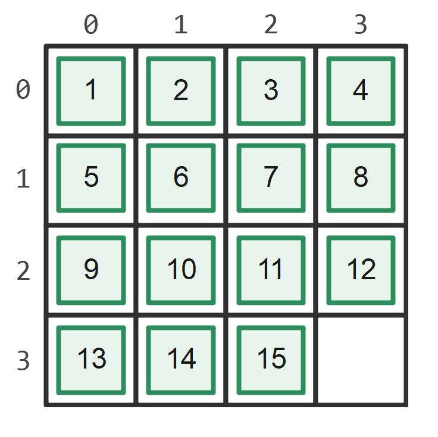
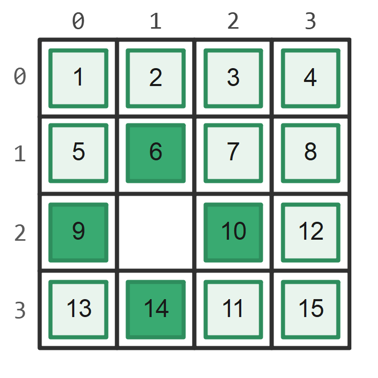
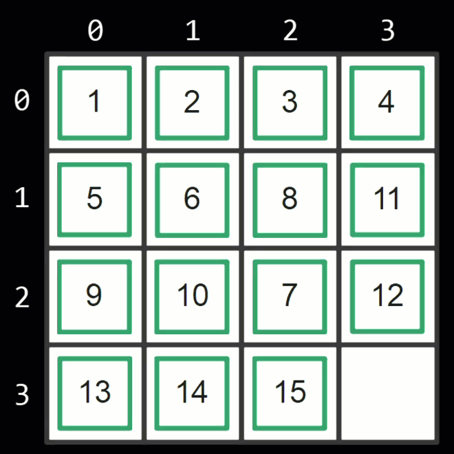

This project is a contribution for CodinGame, a solo game using the [Game Engine Toolkit](https://www.codingame.com/playgrounds/25775/codingame-sdk-documentation/introduction) of [CodinGame](https://www.codingame.com/).

# The Game
In this problem, you will solve a KLOTSKI number puzzle. 

# Rules
To win, you need to fully arrange the 4 x 4 board in the correct order by sliding the pieces.

The correct order:

<p style="text-align: center;">
    
</p>


# Initialization Input

To input a 2D array `A` there will be 4 lines of input, each line consists of 4 integers.

The `c`th integer in the `r`th line, `A`<sub>r,c</sub>, ranges from 0 to 15. `A` is guaranteed to include all integers from 0 to 15. 

# Game Turn

There are no inputs for a Game Turn.

In each turn, you must swap the number 0 with any adjacent number (in the up, down, left, right direction of number 0 without exceeding the border) in array `A`, or in other words, slide the block beside the empty spot.

<p style="text-align: center;">
    
</p>

<p style="text-align: center;">
    
</p>


# Output

Each turn you should output two integers `r` and `c`, indicating you are sliding the block in the `r`th row and the `c`th column, in short (r,c).

While in the correct order, number 1 is at (0,0) and number 7 is at (1, 2).


# Wrong Output

- `r`<0 or `r`>3 or `c`<0 or `c`>3 

- Among existing `A`<sub>r+1,c</sub>, `A`<sub>r-1,c</sub>, `A`<sub>r,c+1</sub>, `A`<sub>r,c-1</sub> there is no number 0.

# Example


<table style="width:100% ;height:100%">
<tr>
<td> Input </td> <td> Output </td>
</tr>
<tr>
<td  valign="top"> 

```
1 2 3 4
5 6 8 11
9 10 7 12
13 14 15 0
```

</td>
<td>

```
2 3
1 3
1 2
2 2
2 3
3 3
```

</td>
</tr>
</table>

# Expert Rules 

Small reminder: there will be cases requiring hundreds of turns to solve, and after each turn `A` will change and your program should keep track of that :D

The common strat includes 3 steps:

- put number 1 to 4 in their correct locations and never deal with the first line ever again. 

- Similarly, put number 5 to 8 in their correct locations and never deal with the second line ever again. 

- Arrange the last two lines (which is a bit hard). 

# Victory Conditions
- After a game turn, the 2D array A equals to the following:
```
{
    {1, 2, 3, 4},
    {5, 6, 7, 8},
    {9, 10, 11, 12},
    {13, 14, 15, 0}
} 
```
- There is almost no need to minimize the total steps

# Loss Conditions

- Exceed the turn limit of 500.
- Wrong input.

# Constraints

$0 \leq $ `A`<sub>r,c</sub> $ \leq 15$ for <sub>r</sub> ∈ [0, 3] and <sub>c</sub> ∈ [0, 3]


